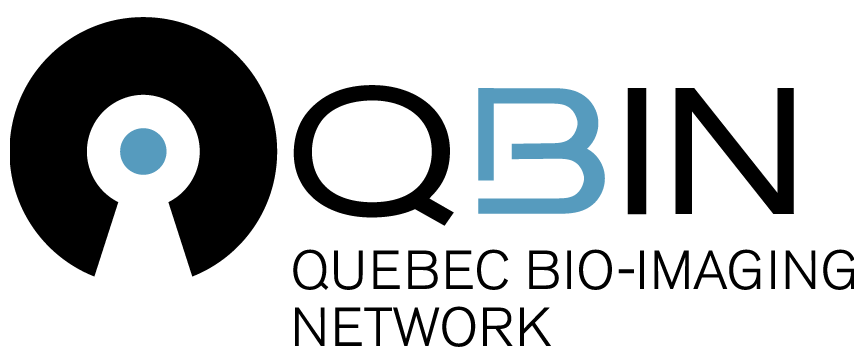

# *Cerebronze*

 

*Cerebronze* (2024) 
illiez, Ranjini Garani & Nelly Blanken 
In collaboration with Olivier Nadeau Seguin & Peter Vrana 
Bronze, steel - 3m x 1m x 1.5m (4 pieces 60x30x150cm)

---

*Cerebronze* is a bronze sculpture exploring neuroscience through a playful and tangible representation of neuroimaging techniques. The installation consists of four freestanding bronze-cast pieces replicating a sagittal slice of the human brain. The individual pieces take the shape of the four cerebral lobes – frontal, parietal, temporal, and occipital – placed so as to offer perspectival play. Viewers are invited to navigate the sculpture, discovering different facets of the human brain. 

The depictions of brain structure taken from magnetic resonance imaging (MRI) scans are complemented by representations of brain chemical activity inspired by positron emission tomography (PET). These choices, partly aesthetic, also find their justification in the imaging process itself: the PET scans acquired are overlaid onto MRI for the identification of regional brain chemical activity. 

The realization of the sculpture is divided into several stages. First, the MRI files are processed and modeled in a 3D software. The models are then milled in wood using a CNC machine. A silica mold is layered around the wood, which is then burned out of the solidified mold. The pieces are then cast in bronze. Finally, heat is strategically applied to craft an artistic representation of a PET activation color map across a brain slice, illustrating neurochemical activity.

 

Although this project aims for scientific accuracy in portraying brain functionality, the introduction of bronze brings with it a level of unpredictability and artistic abstraction. While the manufacturing techniques highlight the fusion between traditional artistry and modern technology, placing a bronze sculpture outside conventional spaces aims to make both science and art more accessible to the public. 

Blending visual appeal, physical interaction, and reflection, *Cerebronze* aspires to offer new perspectives on brain function, providing a space where art and science converge to ignite curiosity and deepen understanding. 

 

Exhibitions:
- Convergence 7, Research Institute of the McGill University Health Centre (Montreal, Quebec)
- Neuroreceptor Mapping (NRM) Conference, Centre Mont-Royal (Montreal, Quebec)
- QBIN Scientific Day 2024, Concordia University (Montreal, Quebec)
- Douglas Research Day, Douglas Mental Health University Institute (Montreal, Quebec)
- NeuroLingo Spring 2024 Edition, Bibliothèque et Archives nationales du Québec (Montreal, Quebec)
- Amazing Brain (HBHL), PHI Centre (Montreal, Quebec)
- HBHL symposium. 

Supported by the Convergence Initiative, Quebec Bio-imaging Network (QBIN), Concordia Student Union (CSU) and Concordia University Alumni Association (CUAA).

