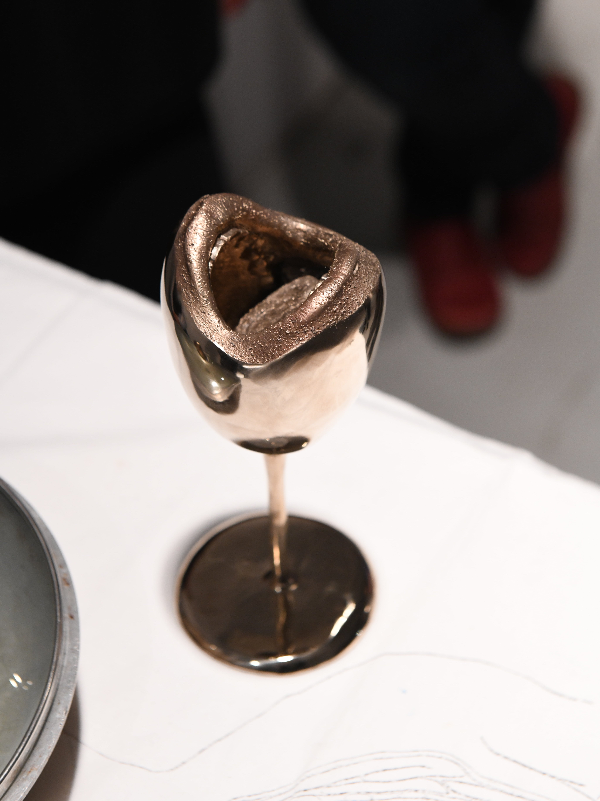

# *Memento manducare*

Memento manducare (2022) 
Bronze, found objects 
50 x 100 cm 

*Memento manducare* is a sculptural exploration of the role of the body in alimentary practices and related social discourse, existing as a collection of somatically-inspired objects combining traditional industrial kitchenware shapes with organic corporeal forms.

The collection includes a set of five bronze-cast pieces (a spoon, a fork, a goblet, a cup and a mug) as well as two assemblages joining bronze pieces with existing objects (a pan lid and a stovetop espresso pot). The flatware merges traditional cutlery handles with lifecast body parts: the spoon bowl is a human ear, and the fork tines a toddler’s hand. The drinkware amalgamates the unremarkable exterior of drinking vessels with a striking interior emulating a mouth cavity. The two assemblages incorporate bronze-cast toes as knobs for pot and pan lids. 

Distorting the artistic trope of the memento mori, the piece acts as a broader reminder of one’s own edibility, which, rather than harnessing the moralizing judeo-christian fear-mongering morbidity of mortality, intends to resituate the viewer both physiologically as well as ecologically. In an age of accelerated productivist mechanization and increasingly disembodied virtualization, Memento manducare harnesses uncanny visual and sensory experiences to reinvest carnality. The objects serve to disrupt a societal tendency towards corporeal abnegation, confronting the viewer with tableware unusably inconvenient and unexpectedly sensual, forcing a rereading of the situation and recontextualization of eating as a fundamentally somatic process.

