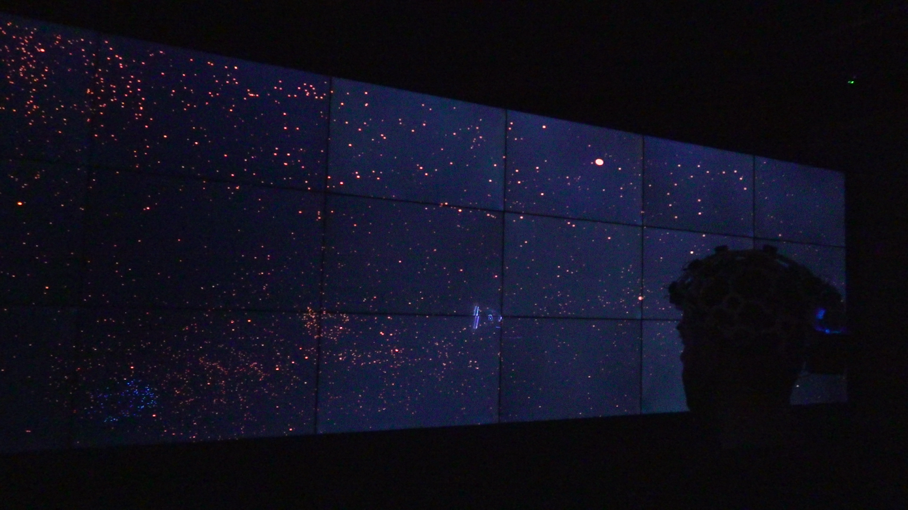
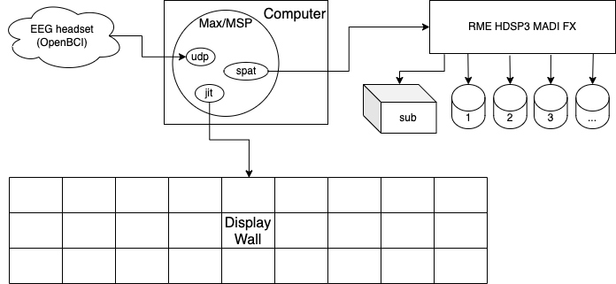
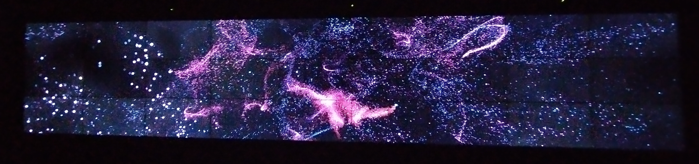
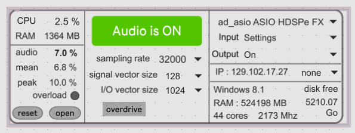
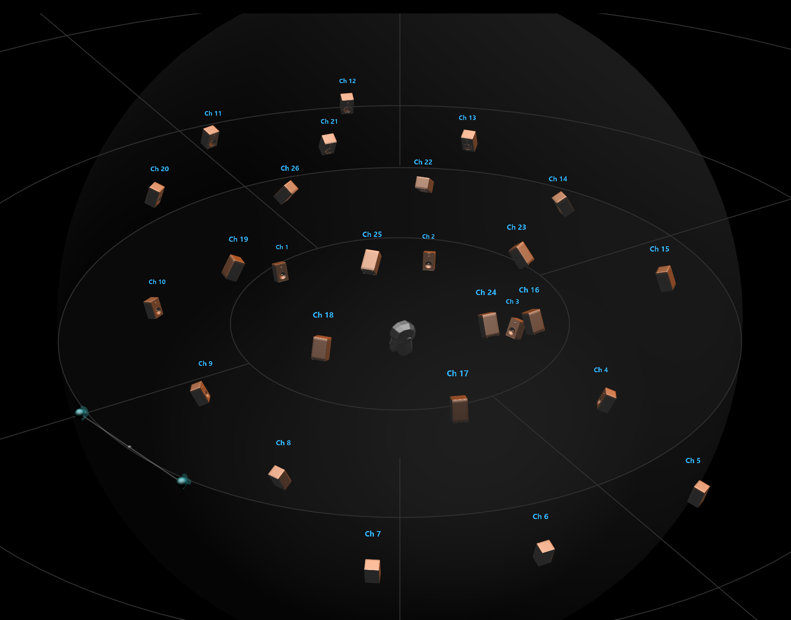
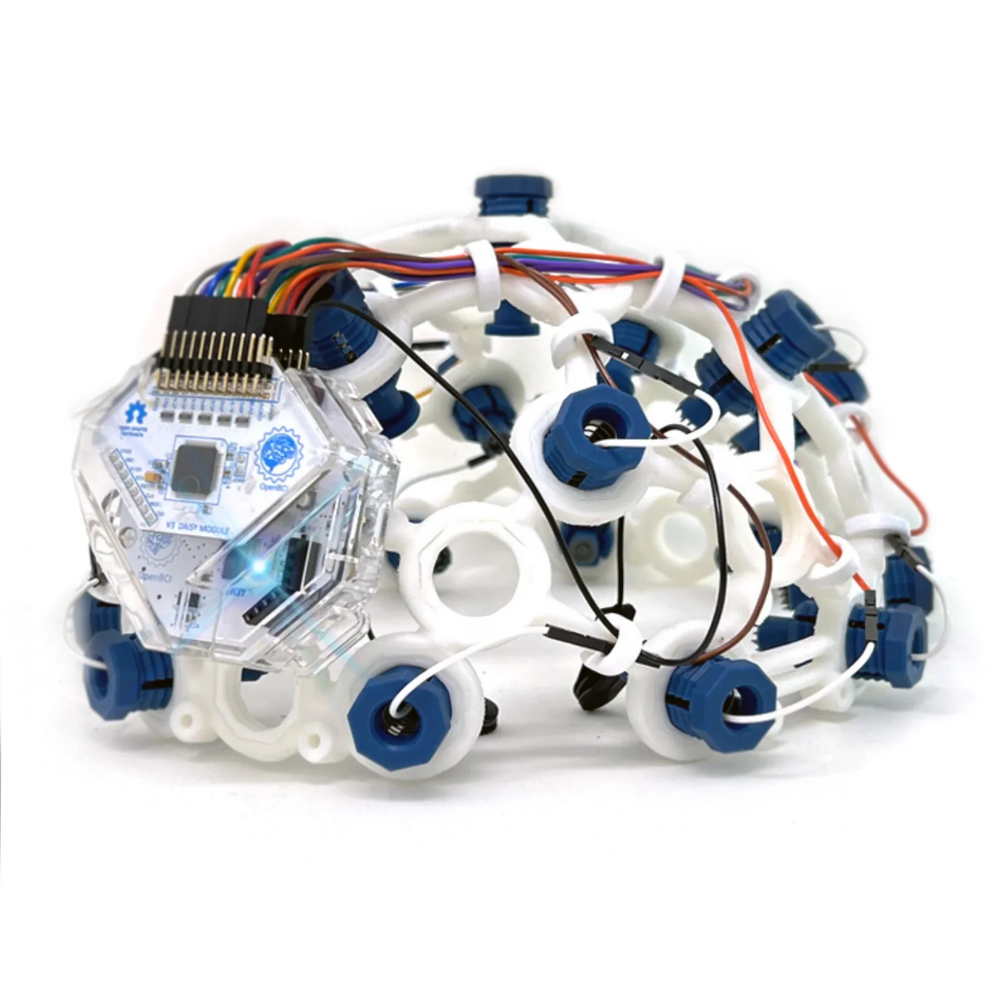
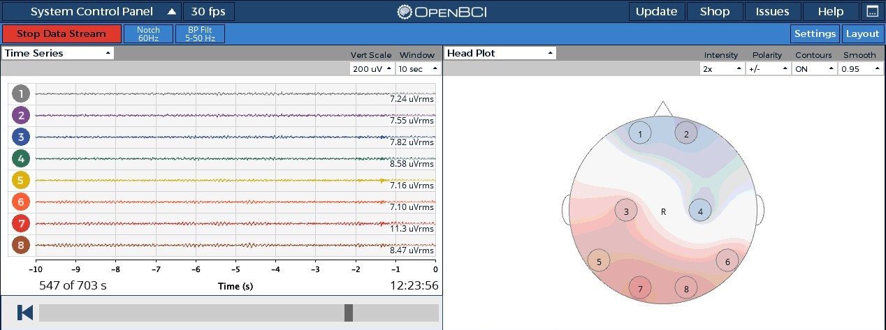

# *Neurogenesis*

Neurogenesis (2023) 
Max/MSP, OpenBCI_GUI, OpenBCI EEG headset, 27-screen display wall, 27-speaker sound system 

## Demos
[Short documentation](https://youtu.be/TM4ktU5Gmj0) 
[Long screen-recording](https://youtu.be/lwD9mxit4yI)

## Keywords
neurocentrism, EEG, bioart, neuroenchantment, particle systems, sound spatialization

## Background
*Neurogenesis* focuses on the ramifications of neurocentrism in intrapersonal perception. 
Neurocentric discourse, which forefronts brain-based interpretations of human experience, has percolated from academic circles to popular culture. While there are benefits to this vulgarization of neuroscience, from a broad democratization of scientific knowledge to specific re/appropriations of dispossessive psychiatric language, there also exist downsides, such as epistemic abuses exploiting credulity. I am interested in problematizing the broader societal consequences of neurocentrism. Drawing from artistic and scientific modes of inquiry, I seek to integrate speculative creation, imaginative research and multidisciplinary crowdsourcing to create a feedback loop between science, art, public and data. Neurogenesis constitutes a first step in this direction. Building off of experience in neuroscience, data visualization and acoustic spatialization, it serves as an initial naive attempt to explore neuroart, circumscribe the crux of this conceptual space and reflect on popular perceptions of neuroscience.

## Description 

*Neurogenesis* is an immersive neuroartistic audiovisual experience. An EEG headset produces neural activation data which procedurally modifies a visual particle system as well as an acoustic spatial environment. The project runs entirely on Max/MSP, implementing different toolkits and packages to deploy the various elements. The EEG signal is processed via UDP wireless communication and OSC data ingestion, the particle system harnesses the Jitter toolkit to manipulate OpenGL vector graphics and the audio environment relies on IRCAM’s Spat package to spatialize sound output.

Currently hosted at Concordia University’s Visualization Studio, the experience positions the viewer in front of a planar visual display wall and at the center of an immersive audio system. The display wall aggregates 27 Full HD LCD monitors in a single contiguous screen measuring 9.2 by 1.7 meters, producing a 16:3 display with a resolution of 17,820 by 3,240 pixels.

The audio system presents 26 studio monitors and 1 subwoofer arranged in an ad hoc elongated domoid of 10 meters in radius with 3 speaker altitudes (10 monitors and the subwoofer low, 10 monitors mid and 6 monitors high), enabling precise acoustic mapping via an RME HDSPe MADI FX soundcard.

The neural data is collected using an OpenBCI Ultracortex Mark IV, a harmless and non-invasive EEG headset. Using the Cyton and Daisy Biosensing Boards, the real-time electrophysiological signal from 16 discrete EEG channels – as well as higher-level data such as a global activation head plot and abstracted band powers – is wirelessly transmitted to the computer where it is ingested in Max/MSP using an ad-hoc program and processed to extract different components of the signal.

1 Though, for a discussion on systemic bias in EEG measures, see Louis et al., 2022 ; Choy et al., 2022 ; Etienne et al., 2020

The visual and acoustic elements of the environment rest on generative models resulting in a rudimentary entanglement of abstract sights and sounds. The different components of the EEG data are processed as discrete neurophysiological trends (base voltage, global activation and band power) and used to modulate the parameters of the models.

While I intend for Neurogenesis to eventually hold its own as an neuroartistic audiovisual experience, this project also seeks to explore how people respond to neuroscience-based art. The recent increase in accessibility of neuroscientific tools such as EEG has led to a surge of neuroart, most often marketed as personalized and introspective. Yet, this art inevitably confronts the obstacle of transforming massive amounts of inherently unintelligible data into aesthetically arousing phenomena, usually resulting in substantial data transformation.

I am specifically curious about the relation between data processing and neuroartistic experience. How much transformation can take place before the neuroart loses its aura of authenticity? Does the amount of processing correlate with the subjectivity or intensity of the experience? Does the data even need to be present to foster a genuine aesthetic experience, or have we sufficiently internalized conventional artistic interpretations of neurosubjectivity to dispense with its actual representation?

In the context of this project, and to provide preliminary answers to these questions so as to guide future research and creation, the viewers will be distributed in two groups: one where the EEG data will be integrated into the audiovisual experience, and another where it will not. The intention here, beyond beginning to delve into the techniques and technologies of audiovisual neuroartistry, is to establish an initial coarse methodology and direction by collecting information about the intensity, intimacy and self-reflexivity of the experience from the public post-hoc. This will be folded into subsequent iterations of this project as well as to other explorations.

## Glossary
**Electroencephalography (EEG)**: a neuroscientific technique that monitors the electrical activity in the brain by tracking patterns of electrical impulses generated by the brain's neurons. Activity can be read at the level of individual electrode output as well as broader neurophysiological trends (i.e. brain waves). The data collected is quantitatively analyzed and can be represented as activity-based patterns on the cortex.

**Neuroart**: Art influenced or inspired by neuroscience, especially the study of the brain and its functions. This interdisciplinary approach harnesses ideas (e.g. cognition, perception, consciousness), findings (e.g. data, principles) or techniques (e.g. brain imaging, electrophysiology) from neuroscience to inform the conceptual basis of or support the practical expression of the artistic creation (visual art, music, literature, performance). It can provide unique insights into the complexity of the human mind, and usually seeks to bridge the gap between art and science.

**Neurocentrism**: an epistemological approach centering the biological brain as the basis for understanding human experience across affect, cognition and behaviour, usually at the expense of other factors such as body, environment or culture.

**Neuroenchantment, neuroplacebo, neuromyth, neurobullshit**: coinages variably addressing the epistemic authority of neuroscience and its cultural ramifications (e.g. hype, fascination, misdirection, exploitation).

**Placebo**: a substance or treatment with no proven therapeutic or medicinal properties, usually used to assess the effectiveness of another substance or treatment by comparison. Placebos can nonetheless elicit perceived as well as measurable changes. A superplacebo is a placebo that is perceived as having therapeutic or medicinal properties by both the prescriber and the consumer.

## Acknowledgments
This project is indebted to David Clark for technical wizardry and kind presence.

