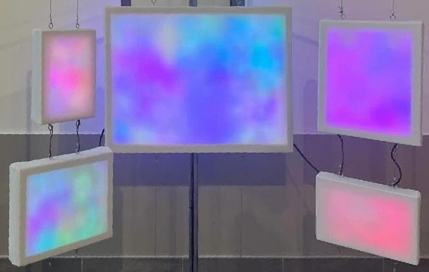
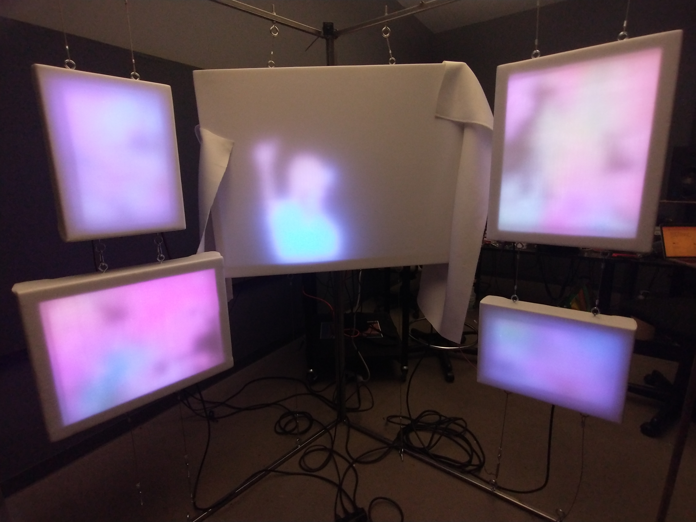
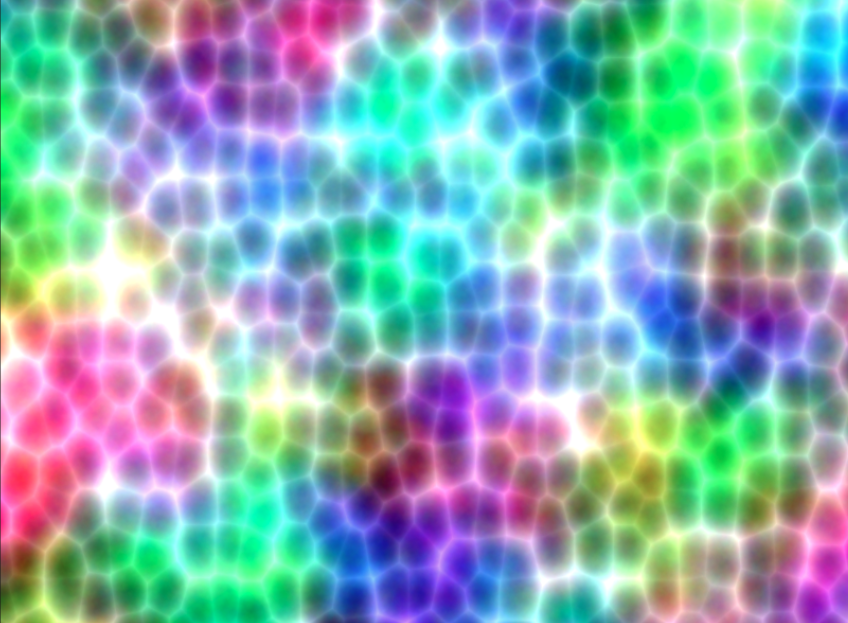
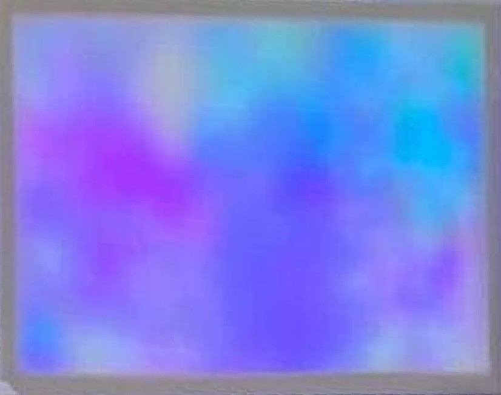

# *Symphenia*

 

*Symphenia* (2024) 
Interactive installation (Wood, fabric, steel, acrylic, electronics) 
Durcheinander Collective (illiez, Sarah Hontoy-Major, Liana Kaloussian, Antoine Bou Khalil) 

---

*Symphenia* is an interactive experience harnessing computational, sculptural and electronic art to represent the neuroscience of perception, exploring concepts of attention, interpretation and cognition through rich visual stimuli and layered technologies. The piece consists of a polyptych of 5 custom-made LED panels, animated by viewer interaction using real-time body recognition.

 

At rest, the panel displays colour patterns driven by chaotic algorithms, echoing the divergent spontaneity of unstimulated neural activity. Translucent stretch fabric drawn over the panel diffuses the light source into a gestalt whole, highlightin the perceived continuity and completeness of sensory experience.

 

A camera mounted above the panels feeds a machine learning model detecting human body contour, which triggers a slow convergence towards chromatic homogeneity within the detected silhouette. This gradual visual variation emerges from the Durcheinander rate, our ad hoc algorithm which serves as the computational scaffolding for the representation of ostensibly chaotic yet algorithmically deterministic patterns. Similarly, once the passerby exits the visual field of the camera, the LEDs slowly regress to chaotic variation, lingering longer and leaving traces of our time with the piece.

 

Symphenia is intended as an accessible representation of complex neuroscience concepts, a means for the non-expert community to gain greater understanding of perception and cognition through an interactive artistic experience soliciting soft fascination. Through an interplay between instantaneous and sustained immersive interaction, the audience is invited to bask a colourful world fostering reflection on neuroscience.

